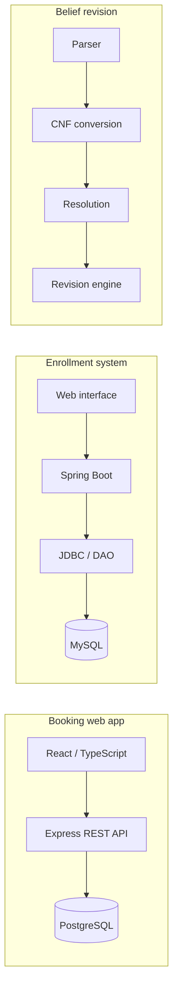

# Khush

**Software Engineering student · Technical University of Denmark (DTU)**  
Building web applications, Java backends, and AI systems with attention to maintainable code, data, and user workflows.

[Featured projects](#featured-projects) · [Architecture](#architecture-at-a-glance) · [Code walkthroughs](#code-walkthroughs) · [Contact](#connect)

---

## Featured projects

| Project | Engineering focus | Explore the code |
|:--|:--|:--|
| **[Common Room Booking System](https://github.com/khush-B/Common-room-booking-system)** | React, TypeScript, Express, Supabase/PostgreSQL; authentication and room-booking workflows | [Frontend](https://github.com/khush-B/Common-room-booking-system/tree/main/block11/client/src) · [Backend](https://github.com/khush-B/Common-room-booking-system/tree/main/block11/server/src) |
| **[Student Enrollment System](https://github.com/khush-B/Education-Enrollment-System)** | Java, Spring Boot, MySQL and JDBC; REST endpoints and CRUD operations | [Controllers](https://github.com/khush-B/Education-Enrollment-System/tree/main/src/controller) · [Data access](https://github.com/khush-B/Education-Enrollment-System/tree/main/src/dao) |
| **[RoboRally Game Coordination](https://github.com/khush-B/Game-SignUp-Web-Application-Backend)** | Spring Boot game-lobby API with JavaFX desktop client | [Backend](https://github.com/khush-B/Game-SignUp-Web-Application-Backend) · [Client](https://github.com/khush-B/Game-SignUp-Web-Application-Frontend) |
| **[Belief Revision AI Agent](https://github.com/khush-B/Belief-Revision-AI-Agent)** | Python, CNF conversion, resolution-based logical inference and automated testing | [Engine](https://github.com/khush-B/Belief-Revision-AI-Agent/tree/main/src) · [Tests](https://github.com/khush-B/Belief-Revision-AI-Agent/tree/main/tests) |

**Also explored:** [2048 with AI](https://github.com/khush-B/2048-game) · [RoboRally board game](https://github.com/khush-B/RoboRally) · [Student enrollment desktop GUI](https://github.com/khush-B/Education-mini-project-with-GUI)

## Architecture at a glance

*These are separate projects, not one integrated application.*

## Code walkthroughs

<strong>01 · How are booking requests handled?</strong>

The project separates the [booking form](https://github.com/khush-B/Common-room-booking-system/blob/main/block11/client/src/pages/BookingFormPage.tsx), [booking API routes](https://github.com/khush-B/Common-room-booking-system/blob/main/block11/server/src/routes/bookings.ts), and [service logic](https://github.com/khush-B/Common-room-booking-system/blob/main/block11/server/src/services/bookingService.ts). Its documentation covers JWT authentication, email OTP verification, and persistent booking data.

[Open project README →](https://github.com/khush-B/Common-room-booking-system#readme)

<strong>02 · How is database access separated from request handling?</strong>

In the enrollment project, [controllers](https://github.com/khush-B/Education-Enrollment-System/tree/main/src/controller) manage HTTP requests and [DAOs](https://github.com/khush-B/Education-Enrollment-System/tree/main/src/dao) manage MySQL queries. The README includes the schema and local startup instructions.

[Open project README →](https://github.com/khush-B/Education-Enrollment-System#readme)

<strong>03 · How does the game client communicate with its backend?</strong>

The [JavaFX client](https://github.com/khush-B/Game-SignUp-Web-Application-Frontend) communicates with a [Spring Boot API](https://github.com/khush-B/Game-SignUp-Web-Application-Backend) to create, join, leave, delete and start online game lobbies. The actual board gameplay runs locally in the client.

[Open backend README →](https://github.com/khush-B/Game-SignUp-Web-Application-Backend#readme)

<strong>04 · Where is logical reasoning implemented and tested?</strong>

The [Python source](https://github.com/khush-B/Belief-Revision-AI-Agent/tree/main/src) covers parsing, CNF, resolution, and belief revision. The [test suite](https://github.com/khush-B/Belief-Revision-AI-Agent/tree/main/tests) covers entailment, belief bases, AGM postulates, and extensions. The repository README reports 235 passing tests; this isn't a live CI measurement.

[Open AI project README →](https://github.com/khush-B/Belief-Revision-AI-Agent#readme)

## Technical toolkit

| Area | Technologies used in repositories |
|:--|:--|
| Languages | Java, Python, TypeScript, JavaScript, SQL |
| Backend | Spring Boot, Express, REST APIs, JDBC |
| Frontend | React, JavaFX, HTML, CSS |
| Data | PostgreSQL / Supabase, MySQL, H2 |
| Engineering | Git, Maven, automated tests |

## GitHub activity

GitHub maintains my contribution graph directly on my [profile overview](https://github.com/khush-B#user-activity-overview), below this introduction. It shows public activity and any private contributions enabled in profile settings.

**[View contribution history →](https://github.com/khush-B?tab=overview)** · **[Explore repositories →](https://github.com/khush-B?tab=repositories)**

For technical evidence, start with the linked source code, documentation and commit history above — contribution counts alone do not measure software quality.

## Connect

- [GitHub](https://github.com/khush-B)
- [Email](mailto:s233967@dtu.dk)
- Interested in software engineering internships, backend development and applied AI.

---
Some projects are university group assignments. Read individual repositories for scope and contribution details.
